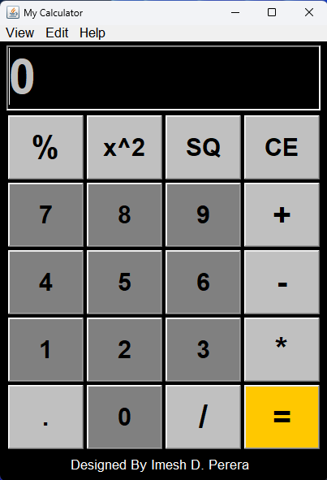
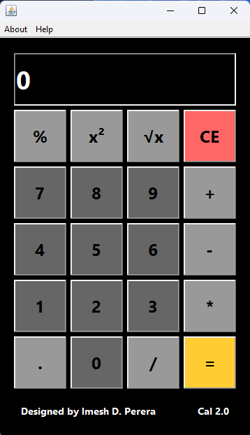

# 🧮 Java Desktop Calculator Series

A professional desktop calculator project demonstrating the evolution from **Java AWT** to **Java Swing**, highlighting GUI development, event-driven programming, and advanced expression evaluation.

---

## 🚀 Overview

This repository contains **two versions** of a desktop calculator:

| Version | Technology | Focus                                        |
| ------- | ---------- | -------------------------------------------- |
| **V1**  | Java AWT   | GUI fundamentals & basic arithmetic logic    |
| **V2**  | Java Swing | Enhanced UI & advanced expression evaluation |

This project was built as part of my journey to strengthen my understanding of:

* Object-Oriented Programming (OOP)
* Event-driven architecture
* Layout management
* Stack-based expression evaluation
* Professional project structuring

---

# 🖥️ Version 1 – Java AWT Calculator

## 📌 Description

A foundational calculator built using **Java AWT (Abstract Window Toolkit)**.
Focuses on understanding GUI components, layouts, and handling user events.

## ✨ Features

* ➕ Addition
* ➖ Subtraction
* ✖ Multiplication
* ➗ Division
* 📊 Percentage
* 🔲 Square (x²)
* √ Square Root
* 🔘 Decimal Support
* 🧹 Clear Entry (CE)

## 🛠 Tech Stack

* Java
* AWT
* ActionListener
* GridLayout
* NetBeans IDE

---

# 🖥️ Version 2 – Java Swing Calculator

## 📌 Description

An upgraded version built using **Java Swing**, featuring improved UI design and a custom expression evaluation engine.

Unlike Version 1, this version supports full expression parsing with operator precedence.

## 🚀 Improvements Over V1

* Modern Swing-based UI
* Dark theme layout
* Stack-based expression evaluation
* Proper operator precedence
* Scientific notation support
* 12-digit display limit
* Improved formatting logic
* Cleaner modular code
* Better error handling (divide-by-zero)

---

# 🧠 Architecture Evolution

### Version 1 (AWT – Basic Model)

```
First Value → Operator → Second Value → =
```

### Version 2 (Swing – Advanced Model)

```
Full Expression → Stack Evaluation → Result Formatting → Display
```

---

# 📂 Project Structure

```
Calculator/
│
├── src/Cal    # AWT_Version
│   └── Calculator.java
│
├── src/Cal    # Swing_Version
│   └── Cal_App.java
│
├── assets/
│   ├── awt-v1.png
│   └── swing-v2.png
│
└── README.md
```

---

# 📸 Screenshots


&nbsp; &nbsp;


---

# 🎓 Learning Outcomes

✔ Java GUI development fundamentals
✔ Event-driven programming
✔ Layout managers (BorderLayout, GridLayout, GroupLayout)
✔ Stack-based expression evaluation
✔ Operator precedence implementation
✔ Scientific number formatting
✔ Clean GitHub project structuring

---

# 👨‍💻 Author

**Imesh Dilshan Perera**
Software Engineer | Java Developer

🌐 Portfolio: [www.imeshperera.com](http://www.imeshperera.com)
💼 LinkedIn: https://www.linkedin.com/in/imeshperera
💻 GitHub: https://github.com/ImeshPerera

---

# 📌 Status

✅ Version 1 – Completed
✅ Version 2 – Completed

---

